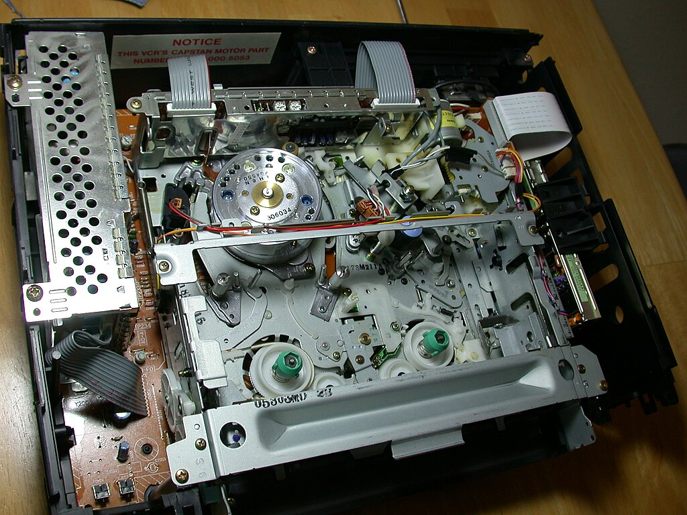
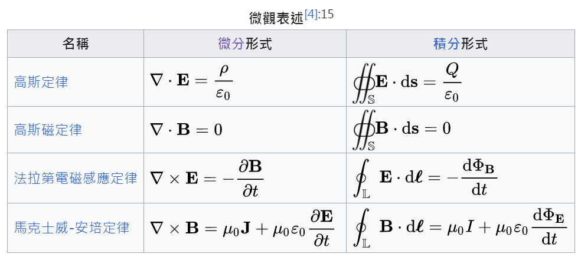
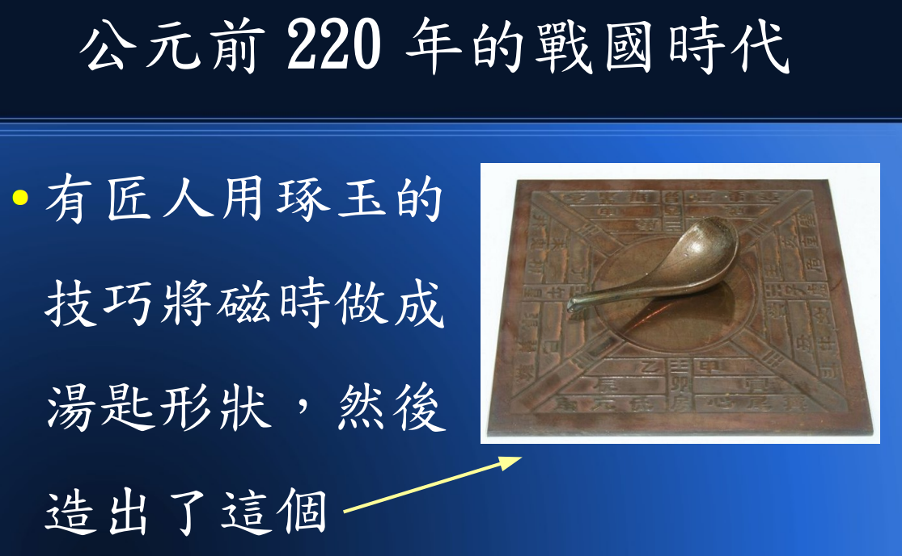
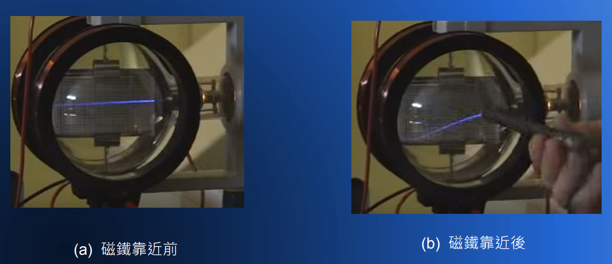

# 我所經歷過的電腦科技史 -- (3)  AV 錄放影機的科技史

話說小學四年級的時候，我父親買了一台 VHS 錄放影機

(那台錄放影機的價錢，似乎父親隱瞞了母親，否則應該會有大災難 ...)

那時的台北，有很多錄影帶出租店，裡面有很多大錄影帶 (VHS) 和小錄影帶 (Beta) ...

錄影帶出租店裡，有各式各樣的電影，還有當時大人們喜歡看的

1. 豬木馬場日本摔角
2. 志村健大爆笑

有時候我會看到，鄰居的爸爸偷偷拿了一支錄影帶給我爸爸，然後爸爸就偷偷的收起來 ...

五年級的時候，我偷偷去開了錄影機下面的抽屜，發現裡面有一支沒有外殼的錄影帶

我知道，這種沒有外殼的錄影帶，在錄影帶店都是放在內側比較不容易被發現的區域

上面用簽字筆寫著幾個潦草的字，像是： 歐美水電工，日本 XXX 

於是我把那支沒有外殼的錄影帶，直接放進 VHS 錄放影機，按下播放鍵 ...

然後、我看到有個水電工進入一個房子，女主人是穿著薄紗的歐美大奶家庭主婦，從後面抱住了他

這時我情不自禁的身體上下搖動，然後雙手自然的握住某個像排檔桿一樣的東西

最後在某種液體噴出之後，我進入了多重宇宙 ...

這時、我不禁會想，錄放影機這麼厲害的科技到底是誰發明的呢？

那時的我，完全不知道答案

現在、我知道了

要追溯錄放影機的發明史，我們得回到《電的旅程》這本書上

錄放影機的技術關鍵，就是電與磁，也就是後來馬克士威方程組所描述的那些技術

這些技術是怎麼來的呢？且讓我們從頭開始

在公元前六世紀，希臘人就發現琥珀摩擦後，能夠吸 引輕小物體的「靜電現象」

而在希臘、印度及中國的古書中，都紀載了磁石與磁力

1453 年東羅馬帝國滅亡後，文藝復興開始了

文藝復興的起點，是義大利的佛羅倫斯，這裡孕育了《文藝復興三傑》

哪三傑？

那就是：達文西、米開朗基羅、拉斐爾

但是、很多人不知道，為何這些《藝術大師》會同時出現 在文藝復興時期的佛羅倫斯呢？

其實，一切都和錢有關！

而這些錢，都來自於一個神祕的家族

這個家族，曾經誕生兩位國王，三位主教，並且創造了今日的《銀行體系》

到底是甚麼家族這麼厲害？

答案就是 – 梅蒂奇 (Medici) 家族

更厲害的是，近代科學的能源火種，就出現在梅蒂奇家族身上

到底、那個能源火種是甚麼呢？

且讓我賣個關子

將焦點先轉移到，他們家的建築工人身上！

話說，佛羅倫斯的建築和教堂，蓋得又宏偉又高大

達文西、米開朗基羅、拉斐爾的藝術成就，都和梅蒂奇家族蓋教堂有密切的關係

梅蒂奇家族的宮殿和教堂，蓋得又高又美又宏偉

但問題是，太高了！

有多高，超過十三公尺

超過十三公尺會怎樣？

不會怎樣，但是，水會抽不上來！

水抽不上來會怎樣？

抽不上來，工人會叫苦連天！

於是，工人跑去告訴工頭，工頭跑去告訴建築師，建築師跑去報告梅蒂奇

於是梅蒂奇，下令找人研究這個問題

找誰研究呢？

於是梅蒂奇家族決定找《伽利略》來研究這個問題 ...

但是《伽利略》還沒解決問題，就死了！

於是、梅蒂奇家族的托斯卡納伯爵，又找了一個科學家，繼續研究！

那個科學家，名字叫托里拆利

《托里拆利》是《伽利略》的學生

托里拆利仍然沒有解決抽水的問題 ...

但是、很多事情，不能只看結果，更重要的是過程

還有那些，無心插柳的過程當中 所產生柳成蔭的東東！

1643 年托里拆利證明了，光靠大氣壓力是不可能把水抽上那高樓的

因為大氣的壓力，只有 76 公分水銀柱，相當於十三公尺

所以只要超過 13 公尺，水就不可能抽上來了 ...

在這個研究的過程中，托里拆利發明了氣壓計，還發現了《托里拆利真空》

後來在 1650 年，《奧托 · 馮 · 居 里克》 Otto von Guericke 利用它設計 了一台「真空幫浦」

《馮 · 居里克》做好真空幫浦後，還展示給神聖羅馬皇帝斐迪南三世看

結果，用了 30 匹馬對拉，都無法拉開那兩個 抽了真空的半球。

這就是著名的「馬德堡半球實驗」。

後來、在 18 世紀時，很多人開始研究電的現象

像是富蘭克林、安培、伏打、法拉第等等，這些故事大家在物理學裡都學過了

一根抽成真空的玻璃管，只要在兩邊接上電極，然後加上電壓

你就會看到有亮亮的電子束射出

1890 年的時候，英國人威廉·克魯克斯發現了這個現象，後來德國人卡爾·費迪南德·布朗在陰極射線管上塗佈熒光物質，於是陰極射線管就誕生了。

1897年，德國物理學家卡爾·布勞恩發明了一種帶螢光螢幕的陰極射線管。當電子束撞擊時，螢幕上會顯示亮光。當時布勞恩的助手曾提出用映像管做電視的顯示器，固執的布勞恩卻認為這是不可能的。

1906 年，布勞恩的兩位助手用這種陰極射線管製造了一台畫面接收機，進行影像重現。但他們的這種裝置重現的是靜止畫面，應該算是傳真系統而不是電視系統。

1910年，波瑞斯·羅星（Boris Rosing）和他的學生弗拉基米爾·佐利金驗證了在發射機中用快速轉動的鏡面掃描裝置和在接收機中使用陰極射線管的電視系統。

1925年10月2日被蘇格蘭人約翰·洛吉·貝爾德在倫敦的一次實驗中用半機械式類比的方式，「掃描」出木偶的影像，這被看作是電視誕生的標誌，於是被稱做「電視之父」。

1926 年匈牙利發明家卡爾曼·蒂哈尼使用電子技術設計電視系統，並在 1928 年完成了該系統，這是現代電視真正決定性的技術里程碑。

1927年12月7日，費羅·法恩斯沃斯（Philo Farnsworth）在他的聖弗朗西斯科格林大街202號的實驗室里，首次使用影像分割器（Image Dissector）攝影管傳送了第一個影像：一條簡單的直線[14]。

1928年，法恩斯沃斯研製一套完整的系統給媒體進行演示，由電視傳送一個動畫影片。

1929年，這個系統進一步被優化，去掉電動發電機，現在他的電視系統沒有任何運動部件。同年，法恩斯沃斯使用他的電視系統傳送首個直播人類影像：一個3.5英寸他妻子Pem閉眼的動態影像（也許當時光線太亮的原因）

1928年，「第五屆德國廣播博覽會」在柏林開幕。博覽會中電視第一次作為公開產品展出。有線的機械電視傳播訊號的距離和範圍非常有限，影像也相當粗糙，無法顯示精細的畫面。因為只有幾分之一的光線能透過尼普科夫盤的孔洞，為得到理想的光線，就必須增大孔洞，但畫面將十分粗糙。要提高影像的解析度，必須增加孔洞數目，但是，孔洞變小，能透過來的光線便會減少，影像便會模糊不清。機械式電視的這一缺陷導致這種技術被淘汰。

1929年，英國廣播公司允許貝爾德公司開展公共電視廣播業務，30年代以後，貝爾德又轉向了彩色電視的研究。經過不斷地改進設備提高技術，貝爾德研製的電視效果越來越好，引起了極大的轟動。後來成立了「貝爾德電視發展公司」。隨著技術和設備的不斷改進，貝爾德電視的傳送距離有了較大的改進。

1933年俄裔美國科學家弗拉基米爾·佐利金又研製成功可供電視映像用的攝像管和映像管。完成了使電視放映與顯像完全電子化的過程，至此，現代電視系統基本成型。今天電視攝影機和電視接收的成像原理與器具，就是根據他的發明改進而來。

1934年8月25日法恩斯沃斯在賓夕法尼亞州費城的富蘭克林學會首次給全世界演示一套完整的全電子式電視系統。其他發明家之前只是展示了類似系統的部分功能，或者演示使用靜態影像或者動態影片的電子系統。但是法恩斯沃斯是第一個把電子掃描式電視攝影機和電子掃描式電視接收機整合在一起，提供直播、動態、黑白圖像的系統。不幸的是，他的攝影機需要很強的照明光線，所以他的工作被迫中斷。

1936年，使英國，艾薩克·舒伯特（Isaac Shoenberg）使用弗拉基米爾·佐利金的想法開發了自己的電子攝像管，這個設計構成了為BBC製造的攝影機的核心部件，舒伯特用這種攝像管，在1936年11月2日，一條405線的服務被架設在亞歷山德拉宮的攝影棚內，由安裝在維多利亞大廈頂上特殊製造的桅杆形天線進行廣播。它暫時替隔壁的貝爾德機械式電視系統進行播出，但是它更可靠，也具備最佳解析度。而桅杆形的天線一直沿用至今。這台完全用電子式電視系統播放的節目，給人們留下了深刻的印象。同年德國柏林舉行的奧林匹克運動會的報導，共使用了3台攝影機拍攝比賽情況。佐利金發明的全電子式攝像機，但這台機器體積龐大，它的一個1.6米焦距的鏡頭就重45公斤，長2.2米，被戲稱為電視大炮。這4台攝影機的影像訊號通過電纜傳送到帝國郵政中心，圖像訊號在那裡經過混合後，通過電視塔被發射出去。柏林奧運會期間，每天用電視播出長達8小時的比賽實況，共有16萬多人通過電視觀看了奧運會。

1939年，英國大約有2萬個家庭擁有電視機，美國無線電公司的電視也在紐約世博覽會上首次露面，開始第一次固定的電視節目演播。二戰的爆發使得剛發展起來的電視的發展停滯了10年。戰爭結束後，電視工業又蓬勃發展起來，電視也迅速流行起來。

1946年，英國廣播公司恢復了固定電視節目，美國政府也解除了禁止製造新電視的禁令；電視工業便飛速發展起來。

1949年到1951年的美國，不僅電視節目已在全國普遍播出，電視機的數目從1百萬台升至1千多萬台，成立了許多家電視台。幽默劇、輕歌舞、卡通片、娛樂節目和好萊塢電影常在電視中播出。

1954年，日本馬自達研究所（日語：マツダ研究所，Mazda Research Laboratory）澤崎憲一（日語：澤崎憲一／さわさき けんいち Sawazaki Kenichi）博士發明螺旋掃描式磁頭，隨後用於磁帶式錄放影機

1956年，金斯伯格和安德遜設計的Modoll VRllo錄放影機的問世，使電視技術前進了一大步。因最初製作電視節目一般採用兩種方式。一種是用電視膠片把節目拍攝下來，沖洗，再通過電子掃描播出。採用這種方法的一個最大的缺陷，是無法進行電視節目的實況轉播。另外一種是用攝影機直接把訊號傳播出去。這雖然滿足了那些希望目睹現場情景的觀眾的需要，但是它不能重放。錄影機的出現改變了這種狀況。

1956年，美國Ampex公司推出 VRX-1000 商用錄放影機，被電視行業採用，採用四磁頭錄影系統，以90度間隔安裝四個旋轉磁頭，每個磁頭各讀取寫入四分之一的圖像電訊號在2英吋寬的磁帶，磁帶儲存來自四個磁頭匯聚電訊號，存在因磁頭不同產生視頻圖像失真且接縫明顯的缺點。後來採用澤崎健一研發的螺旋掃描式磁頭，可以用一個磁頭在磁帶磁軌上無縫記錄影像

1959年，日本東芝採用螺旋掃描式磁頭技術加上美國Ampex四磁頭錄影系統專利，推出商用磁帶錄放影機，此時電視行業商用錄放影機已統一技術規格，錄影帶可以互換播放。

1972年，日本索尼公司推出U-Matic錄影帶系統規格錄放影機，採用3／4英寸盒式磁帶，根本上改變電視節目的製作方法，是世界上第一個專業彩色錄影放映系統使用的盒式磁帶

## 補充：從 AV 到原子彈

後來、拉賽福領導的《卡維迪許實驗室》，不斷用陰極射線管做轟擊實驗，產生了將近十個諾貝爾獎得主

1911 年，拉賽福和學生觀察到，用陰極射線轟擊金箔，射線大部分穿過去，有些會歪掉，但很少數還會彈回來！

這代表甚麼意思？

代表裡面有很小且硬硬的東西，大部分的射線穿過去沒有撞到，有些射線撞到了硬硬的東西，所以歪掉了，有些射線正面撞上硬硬的，所以彈了回來

所以拉賽福推斷，表原子裏面應該有又小又硬的東西 – 一點都不像他老師湯姆生所說的布丁

但是拉賽福得獎的原因不是這個實驗，而是 1898 年他在加拿大麥吉爾大學物理系主任時，實驗發現了放射性的半衰期，並命名放射線為 α 和 β 射線，

為甚麼拉賽福的學生們，可以得那麼多諾貝爾獎呢？

讓我們一一列出得獎原因：

* 學生 1: 詹姆斯 · 查兌克 James Chadwick 
    * 發現中子並量到其質量。
* 學生 2: 尼爾斯 · 波耳 Neils Henrik David Bohr
    * 量子力學的電子軌域模型。
* 學生 3: 約翰 · 考克饒夫 John Douglas Cockcroft
    * 用粒子加速器分裂原子
* 學生 4: 歐內斯特 · 沃爾頓 Ernest Thomas Sinton Walton
    * 用粒子加速器分裂原子
* 學生 5: 愛德華 · 阿普爾頓 Edward Appleton
    * 發現大氣電離層
* 學生 6: 奧托 · 哈恩 Otto Hahn
    * 發現核分裂現象
* 學生 7: 彼得 · 列昂尼多維奇 · 卡皮察 Пётр Леонидович Капица
    * 發現液態氦在低溫下的超流體現象

以上是從維基百科查出來的，不過就算加上拉賽福本人，這樣也才只有八個諾貝爾獎，這和維基百科說的有十個諾貝爾獎學生還有一點點距離 ...

你可以看到，電子射線撞出原子核模型，電子會轉彎可以算出荷質比，原子核模型質量不對，所以找到中子，中子再拿來撞下去，導致核分裂，核分裂一個撞兩個，兩個撞四個，連鎖反應大爆炸就是 原子彈

所以、如果當初，梅蒂奇家族的宮殿與教堂沒蓋那麼高，水就不會抽不上來，托里拆利就不會發現真空，就沒有後來的真空幫浦，沒有真空幫浦抽空玻璃管，就沒有陰極射線，就不能拿來轟 轟轟，沒有轟轟轟，拉賽福就不會提出原子模型，也不會發現中子，沒有發現中子和放射性，就不會撞到核分裂，造不出原子 彈，也不會有電視機、電腦螢幕、真空管、示波器等等裝備

## 參考文獻

* [維基百科:電視](https://zh.wikipedia.org/zh-tw/%E7%94%B5%E8%A7%86)

* [Journey Through Time: The Evolution of AV Technology](https://21stcenturyav.com/the-evolution-of-av-technology/)